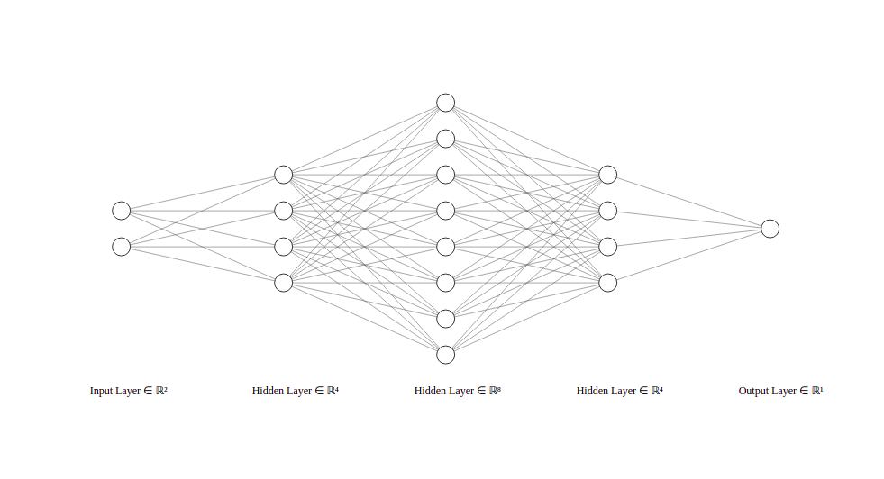
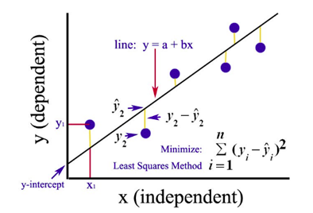
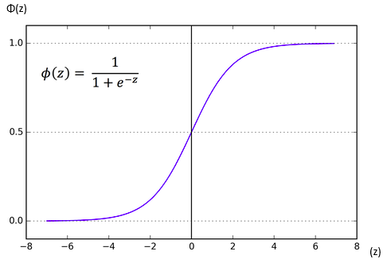
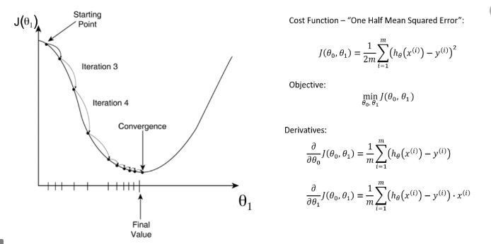
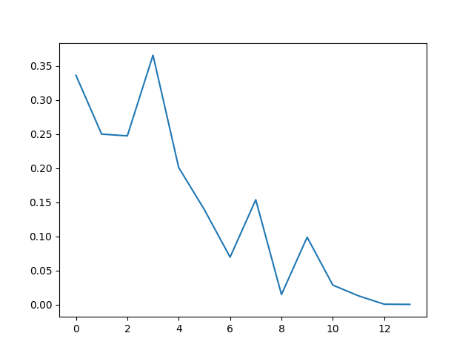
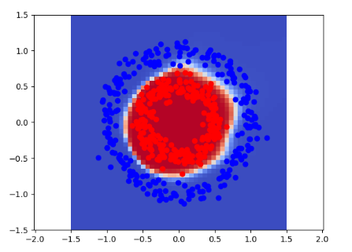

# Neural network implemented in python without libraries.

## Properties
* One input-layer with two perceptron
* One output-layer with one perceptron
* Three hidden-layers with four, eight and four perceptron

* Least squares as cost function

* Sigmoid function for the nonlinearity of the model

* Gradiant descent for reduce cost function

* Learning rate applied to gradient descent = 0.1

## Result 
Graph showing the decrease in the cost function using the gradient descent algorithm. 

Divide points into two factions. 

